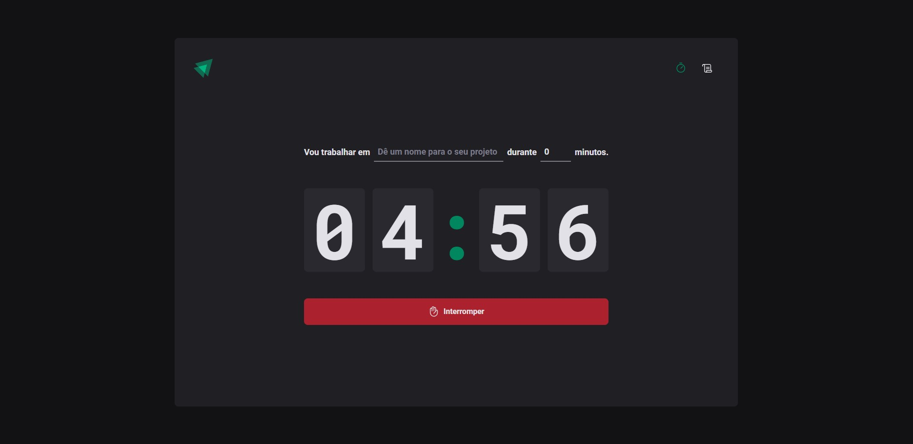
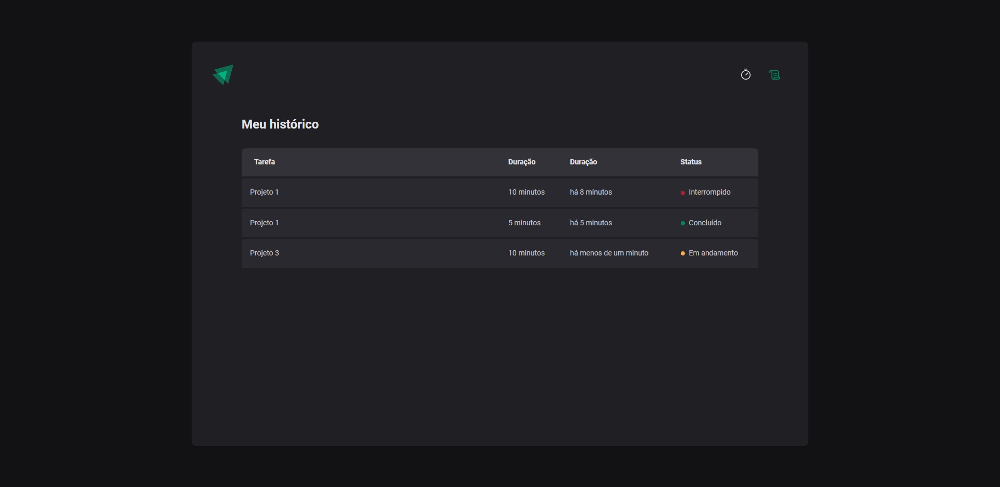

# Timer Pomodo

 ### Tabela de conteúdos

- [Timer Pomodo](#timer-pomodo)
    - [Tabela de conteúdos](#tabela-de-conteúdos)
  - [Visão Geral](#visão-geral)
    - [A Página](#a-página)
    - [Captura de Tela](#captura-de-tela)
    - [Links](#links)
  - [Desenvolvimento do conhecimento](#desenvolvimento-do-conhecimento)
  - [Pré-requisitos](#pré-requisitos)
  - [Autor](#autor)

## Visão Geral
### A Página

Aplicação em ReactJS de contagem regressiva para o método de foco Pomodoro, com a capacidade de manter um histórico com o status de cada tarefa.

### Captura de Tela

Pagina Home

Pagina Histórico

### Links

- URL da Solução : [Timer Pomodo](https://timer-pomodoro-react-omega.vercel.app/)

## Desenvolvimento do conhecimento

O principal objetivo do projeto foi trabalhar com `state` no React, onde é essencial ter o total domínio para seguir em frente.

Foi trabalhado bastante o conceito do Styled-Components, como a configuração de temas, TypeScript, Rotas, formulários Uncontrolled com validações de campo.

O principal destaque para o conhecimento neste projeto foi trabalhar com *Contextos* tornando a aplicação mais dinâmica e evitando o `PropDrilling`.

E com a finalização do projeto foi aplicado o uso do `useReducer` um hook do React que é geralmente preferível em relação ao useState quando se tem uma lógica de estado complexa que envolve múltiplos sub-valores.

Os ciclos da aplicação também são salvos no `storage` de maneira que o usuário tenha sempre o histórico em mãos independente se a aplicação foi fechada.

## Pré-requisitos

Para visualizar a página hospedada basta clicar no link disponível acima nesta página.

Para executar o projeto *local* utilizamos os comandos:
> yarn install

Logo em seguida:

> yarn run dev
> 
E a aplicação poderá ser visualizada nas suas respectivas rotas:
`http://localhost:5173/`

## Autor

Danilo Calegaro - [danilocalegaro.dev.br](https://danilocalegaro.dev.br/)